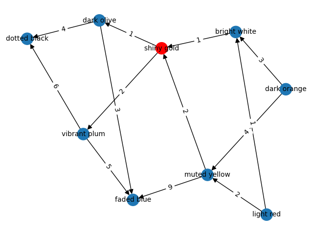

# AoC20

My solutions for [Advent of Code 2020](https://adventofcode.com/2020). In Python 3.

I'll be updating this as a sort of mini blog whenever I can, commenting on the daily problems.

You can also check out our fancy [custom private leaderboard](https://meithan.net/AoC20/), with medals awarded to the fastest solvers. See (and download/fork!) the project [here](https://github.com/meithan/AoCBoard).

Go to day: [1](#day1) - [2](#day2) - [3](#day3) - [4](#day4) - [5](#day5) - [6](#day6) - [7](#day7) - [8](#day8)

___

**Day 8**: [Handheld Halting](https://adventofcode.com/2020/day/8)

5m 7s (#462) / 11m 33s (#2413) - [code](https://github.com/meithan/AoC20/blob/main/day08.py)

Pretty straightforward. The program exits if we come back to a previously executed instruction; this *will* result in an infinite loop since the effect of the instructions does not depend on the value of the accumulator.

For Part 2 we simply execute modified version of the program, changing one jmp or nop instruction each time, and stop when that leads to a normal program termination.

___

**Day 7**: [Handy Haversacks](https://adventofcode.com/2020/day/7)

26m 22s (#1979) / 54m 55s (#2907) - [code](https://github.com/meithan/AoC20/blob/main/day07.py)

This was a bit more difficult than previous problems. The relationships between the bag types (color/pattern), i.e. which bag holds which bags, can be represented as a weighted [directed graph](https://en.wikipedia.org/wiki/Directed_graph). For the test input provided in the problem statement this looks like this:

Directed edges point from a bag type to the bag types it contains, and weights indicate the number of contained bags of that type.

The Bag class represents each bag type. Its "contents" are the bag types it can contain (a dict having the bag "color" as key and the number of bags as value), and we also keep track of its "parents", i.e. bags that can contain it (which can be multiple; hence, this is not a [tree](https://en.wikipedia.org/wiki/Tree_(data_structure))).

Then it's just a matter of "walking" this graph, starting from the shiny gold bag type. In Part 1, we walk "up" the three, following the parents until no more parents are left to follow. We count how many bag types are encountered.

For Part 2, we walk "down" the three [recursively](https://en.wikipedia.org/wiki/Recursion_(computer_science)) from the shiny gold bag. The number of total contained bags is, in general, equal to the number of directly contained bag types plus the number of each contained bag type times the total number of contained bags in *that* bag type. Hence the calculation naturally recurses, until bags with no contents are reached.

It wasn't really a complicated problem, but a bit more involved than the previous ones. Knowing AoC, I was initially worried about the phrase "be sure to count all of the bags, even if the nesting becomes topologically impractical". It could mean that the graph contained cycles or some other twist. But in the end it did not.

___

**Day 6**: [Custom Customs](https://adventofcode.com/2020/day/6)

4m 5s (#595) / 13m 11s (#2022) - [code](https://github.com/meithan/AoC20/blob/main/day06.py)

This problem basically is about computing set [unions](https://en.wikipedia.org/wiki/Union_(set_theory)) and [intersections](https://en.wikipedia.org/wiki/Intersection_(set_theory)). In my original solution I did this manually. Too late I remembered that Python sets actually support these [operations](https://docs.python.org/3/library/stdtypes.html#set-types-set-frozenset)! Naturally, | is the union operator and & is the intersection operator. Could've saved me some time.

___

**Day 5**: [Binary Boarding](https://adventofcode.com/2020/day/5)

28m 50s (#5221) / 33m 28s (#4336) - [code](https://github.com/meithan/AoC20/blob/main/day05.py)

It is straightforward to simply code the [binary search](https://en.wikipedia.org/wiki/Binary_search_algorithm) process described in the problem. Careful with a possible [off-by-one error](https://en.wikipedia.org/wiki/Off-by-one_error) in how the bounds are updated.

However a smarter solution is realizing that this process is really just [counting in binary](https://en.wikipedia.org/wiki/Binary_number#Counting_in_binary). Each bit represents a partition into halves, with the rightmost bits corresponding to larger partitions. For instance, for the left-right column selection we have:

<pre>      L--             L--
  LL-     LR-     RL-     RR-
LLL LLR LRL LRR RLL RLR RRL RRR
000 001 010 011 100 101 110 111
 0   1   2   3   4   5   6   7</pre>

So simply replacing L by 0 and R by 1 (and F by 0 and B by 1 for the rows), and converting the resulting binary number into decimal also (e.g. `int("0101100", 2)`) yields the correct row or column.

I started this one about 20 minutes late, so I only got 2nd place on our [private leaderboard](https://meithan.net/AoC20). Oh well.

___

**Day 4**: [Passport Processing](https://adventofcode.com/2020/day/4)

7m 31s (#759) / 22m 29s (#579) - [code](https://github.com/meithan/AoC20/blob/main/day04.py)

The kind of string matching problem for which [regular expressions](https://en.wikipedia.org/wiki/Regular_expression) ("regexes") were invented (and Python has a nice [regex module](https://docs.python.org/3/library/re.html)). It was a nice little regex practice; I did have to look a couple of things up on the web. [regexr](https://regexr.com/) is an incredibly useful resource for that!

___

**Day 3**: [Toboggan Trajectory](https://adventofcode.com/2020/day/3)

4m 23s (#483) / 6m 39s (#295) - [code](https://github.com/meithan/AoC20/blob/main/day03.py)

Another easy one. Careful with mixing up the meaning of rows and column in these arrays. And there's no need to actually extend the "forest" to the right, one can simply take the x coordinate modulo the number of columns (using the [modulo operator](https://python-reference.readthedocs.io/en/latest/docs/operators/modulus.html) `%`) to effectively make the array wrap around to the right.

Not fast enough to make the top 100 on either star :/.
___

**Day 2**: [Password Philosophy](https://adventofcode.com/2020/day/2)

2m 47s (#130) / 4m 02s (**#69!**) - [code](https://github.com/meithan/AoC20/blob/main/day02.py)

An easy one ... and I made the top 100 for the second star! Which put me on the global leaderboard! Yay! These are my first ever leaderboard points. And probably the only time I'll be on the global leaderboard (keeping expections low here).

Python's great string manipulation methods (like [split](https://docs.python.org/3/library/stdtypes.html?highlight=split#str.split) and [strip](https://docs.python.org/3/library/stdtypes.html?highlight=strip#str.strip)) contributed to coding the solution quickly. Also note that the bit-wise [xor](https://en.wikipedia.org/wiki/Exclusive_or) operator `^` acts as a *logical* xor when applied to booleans (a not very well documented feature) -- much shorter than writing the same using `and`, `or` and `not`.

___

**Day 1**: [Report Repair](https://adventofcode.com/2020/day/1)

7m 08s (#293) / 8m 06s (#283) - [code](https://github.com/meithan/AoC20/blob/main/day01.py)

I coded the solution to Part 1 in just 2 minutes ... But everyone submitting at the same time [overloaded the AWS instances](https://www.reddit.com/r/adventofcode/comments/k4ejjz/2020_day_1_unlock_crash_postmortem/) AoC runs on! So I could only submit my answer to Part 1 (and unlock Part 2) after waiting for several minutes. As a result [Eric Wastl](http://was.tl/), the creator of AoC, invalidated the leaderboard for this puzzle.

Day 1 is always just a warm-up. The input was short enough that a brute-force check of all pairs and triples looking for the combinations adding up to 2020 did the job. Python lets us do this without using array indices, instead iterating over the elements directly. Isn't that idiomatic!

*A more efficient solution*

This solution works in a reasonable time because the list of numbers is short (200). But if the list had a million numbers it would be a different story. The current brute-force check-all-combinations is O(n^2) for Part 1 and O(n^3) for Part 2. Can we do better?

Sure! Here's a [faster solution](https://github.com/meithan/AoC20/blob/main/day01_fast.py).

On a first pass we load all the numbers in a Python [set](https://docs.python.org/3/library/stdtypes.html#set). This is a data structure that stores items in no particular order (unlike a list) and implements a [hash table](https://en.wikipedia.org/wiki/Hash_table) for quick lookups. The upshot is that asking whether some item is contained or not in the set is an O(1) operation (on average) -- that is, the time it takes does not grow with the number of items in the set, so it doesn't matter if it has 200 or 1 million items in it. Using a list or tuple you have to check all the elements one by one, and that is O(n). Even if you did binary search in a previously sorted list that would be O(log(n)) -- nothing beats O(1).

Then, on a second pass, for every number x in the list we check whether y = 2020 - x is in the set. If it is, then x + y = x + (2020 - x) = 2020 and we've found the answer. If the set lookups are O(1) then this second pass is O(n). Adding that to the O(n) of the first pass, the total running time is O(2*n) ~ O(n). A much more efficient algorithm than brute-force!

For Part 2 we need to iterate twice over the numbers, instead of thrice, and then leverage the set. For every pair of numbers x and y (with x != y), we ask whether z = 2020 - x - y is in the set. If it is, then we have our answer. This solution is O(n^2) instead of O(n^3). Still a great speed-up if the list is large!
