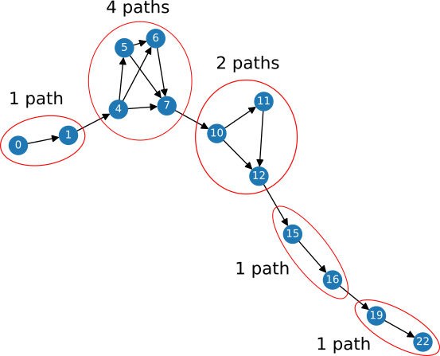

# AoC20

My solutions for [Advent of Code 2020](https://adventofcode.com/2020). In Python 3.

I'll be updating this as a sort of mini blog whenever I can, commenting on the daily problems.

You can also check out our fancy [custom private leaderboard](https://meithan.net/AoC20/), with medals awarded to the fastest solvers. See (and download/fork!) the project [here](https://github.com/meithan/AoCBoard).

Go to day: [1](#day1) - [2](#day2) - [3](#day3) - [4](#day4) - [5](#day5) - [6](#day6) - [7](#day7) - [8](#day8) - [9](#day9) - [10](#day10) - [11](#day11) - [12](#day12) - [13](#day13) - [14](#day14) - [15](#day15) - [16](#day16) - [17](#day17)

___

**Day 17**: [Conway Cubes](https://adventofcode.com/2020/day/17)<a name="day17"></a>

36m 27s (#1503) / 49m 52s (#1690) - [code](https://github.com/meithan/AoC20/blob/main/day17.py)

It was nice encountering [Conway's Game of Life](https://en.wikipedia.org/wiki/Conway%27s_Game_of_Life) (GoL) as I love it profoundly, and it has added significance at this time since John Conway [pased](https://www.theguardian.com/science/2020/apr/23/john-horton-conway-obituary) earlier this year. It is one of those quirky little ideas that turn out to be much, much deeper than it initially appears. The zoo of static and moving [patterns](https://en.wikipedia.org/wiki/Conway%27s_Game_of_Life#Examples_of_patterns) that it contains have been [thoroughly mapped](https://www.conwaylife.com/wiki/Category:Patterns) by mathematicians and hobbyists alike, and their interactions are rich enough that GoL has been [proven](http://rendell-attic.org/gol/utm/index.htm) to be [Turing complete](https://en.wikipedia.org/wiki/Turing_completeness).

Despite having [coded the original](https://www.youtube.com/watch?v=A2Hh9NF-pt0) 2D GoL more than once in the past it's always nice to do it again, and this day's problem gave me an opportunity to think about how to optimize the usual implementation.

My [original solution](https://github.com/meithan/AoC20/blob/main/day17_orig.py) was the usual direct implementation using a large array to store the current cell states and evolving it by applying the rules to every cell, using a second array as a temporary buffer. Since information propagates at a maximum speed of one cell per generation (the "[speed of light](https://en.wikipedia.org/wiki/Speed_of_light_(cellular_automaton))" in GoL) one can determine the size of the arrays required to simulate the game for a given number of generations. The extension to 3D and 4D doesn't really change much, the only differences being that the arrays have to be 3- and 4-dimensional, of course, and that we have to consider more neighbors than the traditional eight when applying the rules.

This implementation takes about 2 seconds to simulate 6 generations ("cycles") for the 3D version in Part 1, and about *3 minutes* for the 4D version in Part 2. While this was enough to get me the stars (and gold medals!), I decided to find a more efficient solution. And that I did: my [optimized solution]((https://github.com/meithan/AoC20/blob/main/day17.py)) takes about *half a second* to solve *both* parts! And other than changing the number of neighbors to check and the number of coordinates used to identify a cell, the code is exactly the same for 3D and 4D (and for 2D as well!).

Here's how it works. Instead of keeping the cells states in a large array we only keep track of *live* (or active) cells, storing them in a [set](https://docs.python.org/3/library/stdtypes.html#set) using tuples with the coordinates as unique identifiers. Any set of coordinates not in the set at any one time are considered dead cells, so we don't need to store their state anywhere.

In each generation, we start by counting the number of neighboring live cells but only for the neighbors of the currently live cells (as opposed to doing it for the whole array in the original solution). To do this we iterate over all live cells and add 1 to a count associated to each of its neighbors. These counts are stored in a [defaultdict](https://docs.python.org/3/library/collections.html#collections.defaultdict) using the neighbor's coordinates as keys with zero as the default value.

After this we can apply the rule concerning live cells. For each live cell we just check the neighbors counts dict for its coordinates: if the value is 2 or 3, the cell lives on and we add it to the `new_actives` set; otherwise, it dies, and we simply don't add it.

For the second rule (currently dead cells with exactly 3 neighbors become active), we could just check the neighbors dict for cells with 3 neighbors, but this can potentially be time-consuming if there are many live cells (and thus many cells with neighbors counts). Instead, during the counting of the active neighbors above we also keep an eye out for any count that reaches 3; when that happens we add that cell to another set of "seed" cells. If a count reaches 4 we remove the cell from the set of seed cells. Thus by the time we're done counting the neighbors we'll know what cells are potentially seed cells without having to do any extra work.

Then, we go over the seed cells: if the cell is currently dead, it becomes active and we add it to the `new_actives` set; if it's currently alive then the rule doesn't apply and we do nothing.

After doing all of this, `new_actives` becomes the new `actives` and we can start the next generation. This completes the algorithm, which turns out to be particularly succinct and intuitive (we don't even explicitly handle the individual cell coordinates). And it is both lightning fast (since sets and dicts are structures with O(1) lookup, addition, update and removal operations) *and* relatively memory efficient as long as dead cells make up the majority of the simulated region, since we hold information only for the live cells compared to having to store and update a whole array which could potentially be mostly dead cells. And we have no simulation space limitation either: the active cells could extend indefinitely far from the "origin" without having to resize anything. I'm pleased with this algorithm.

___

**Day 16**: [Ticket Translation](https://adventofcode.com/2020/day/16)<a name="day16"></a>

27m 6s (#3115) / 48m 16s (#1175) - [code](https://github.com/meithan/AoC20/blob/main/day16.py)

This one was weird and much fun. Difficulty's starting to ramp up a bit. Part 1 was mostly about getting all the input properly parsed (again, [regexes](https://en.wikipedia.org/wiki/Regular_expression) help here) and making simple checks on that.

Part 2 is where it gets interesting: we had to solve a [Constraint Satisfaction Problem](https://en.wikipedia.org/wiki/Constraint_satisfaction_problem), though an easy one that can be solved "directly" without backtracking.

The strategy is as follows. We keep sets of possible positions for every field; initially, all positions are possible for all fields. For a given position in the list of numbers, we check the numbers of all tickets in that position. In each case, we see which rules it violates, and remove that position from the set of possibles for that rule/field. We keep doing this until, eventually (hopefully), one of the fields gets narrowed down to a single possible position. We now know that that field corresponds to that position. We note it down, and then remove that position from the list of possibilities of all other fields. We keep repeating this process for the remaining numbers and positions. Eventually (again, hopefully), this will narrow down all fields to a single possible position, and we'll have our answer.

Here's an example of the logic with the given test input for Part 2 (all tickets are valid already):

```
class: 0-1 or 4-19
row: 0-5 or 8-19
seat: 0-13 or 16-19

your ticket:
11,12,13

nearby tickets:
3,9,18
15,1,5
5,14,9
```

Each field starts with all positions as possibilities:

```
class: [1, 2, 3]
row: [1, 2, 3]
seat: [1, 2, 3]
```

Consider the numbers in the first position of all tickets: 3, 15 and 5 (one can include "your ticket", but the "nearby tickets" had enough information to solve it). 3 violates the 'class' rule, so we cross out position 1 from the 'class' possibilities. 15 violates the 'seat' rule, so we cross out position 1 from the seat possibilities. 5 satisfies all rules, so we do nothing. We now have:

```
class: [2, 3]
row: [1, 2, 3]
seat: [2, 3]
```

Now consider the numbers in the second position: 9 violates the 'seat' rule, so we cross it position 2 from it. 1 and 14 violate no rules. We have:

```
class: [2, 3]
row: [1, 2, 3]
seat: [3]
```

At this point we note that the 'seat' field has been reduced to a single possibility: position 3. So we cross out position 3 from all other fields:

```
class: [2]
row: [1, 2]
seat: [3]
```

As a consequence of this, now the 'class' field has been narrowed down to a single possibility, position 2, so we cross out that position from all fields (if it's still there). We obtain:

```
class: [2]
row: [1]
seat: [3]
```

Now all fields have been narrowed down to a single possibility, and so we're done!

Solving the actual input follows the exact same process, just for many more fields and tickets. As long as we make sure to correctly cross out possibilities as soon as we can, the process will terminate. This was a fun one!

___

**Day 15**: [Rambunctious Recitation](https://adventofcode.com/2020/day/15)<a name="day15"></a>

15m 49s (#1359) / 17m 57s (#675) - [code](https://github.com/meithan/AoC20/blob/main/day15.py)

A relatively easy problem, once you understand the game; I had to read the description a couple times to really get it. The only "trick" there is to it is to be careful about when a spoken number is added to the dict that keeps tracks of when numbers were spoken. Since we need to know when the number last spoken was spoken *before that*, we have to delay adding it to the dict until the next turn.

A big shock, however, was that the code I wrote to solve Part 1 also solves Part 2 with no modification whatsoever (other than the number of turns to play). It takes 16 seconds, but it works as-is. This is unusual for AoC: Part 2 solutions normally require to modify and/or optimize the Part 1 solution.

In fact, I wasn't the only person that was shocked by this: many others commented in the [AoC subreddit](https://www.reddit.com/r/adventofcode/) to report the same thing. A couple of the comments:

> I literally had to make 3 changes to do part 2. Guess that makes up for day 13 psychologically destroying me

> I was kinda shocked when my code printed a solution [for Part 2]. Guess day 13 really did mess with my brain.

I wholeheartedly agree, after the trauma I also suffered from Day 13 Part 2.

___

**Day 14**: [Docking Data](https://adventofcode.com/2020/day/14)<a name="day14"></a>

1h 5m 30s (#5372) / 1h 16m 34s (#3186) - [code](https://github.com/meithan/AoC20/blob/main/day14.py)

Not much to report here, a straightforward string manipulation problem. One can convert an integer to its binary string using built-in function [bin](https://docs.python.org/3/library/functions.html#bin) (it comes prefixed with "0b", which one usually wants to remove), and a binary string back to an integer using [int](https://docs.python.org/3/library/functions.html#int) and specifying base 2, `int(bin_string, 2)`. String method [zfill](https://docs.python.org/3/library/stdtypes.html#str.zfill) fills a string with zeros on the left.

I started about 40 minutes late on this one, so I lost the first gold medal.

___

**Day 13**: [Rain Risk](https://adventofcode.com/2020/day/13)<a name="day13"></a>

8m 5s (#1076) / 2h 1m 15s (#3223) - [code](https://github.com/meithan/AoC20/blob/main/day13.py)

It took me *two hours* to get the second star. I hate you, Chinese remainder theorem!

Part 1 is straightforward: if the earliest departure time is `td`, then `td % p` is how long ago bus `p` last passed, and `p - (td % p)` is how long we have to wait after the earliest departure time until that bus passes again.

For instance, if `td = 939`, bus `p = 7` passed `939 % 7 = 1` minute ago, and so we'd have to wait `7 - (939 % 7) = 6` minutes (time `945`) for it to pass again.

Hence, we simply iterate over the buses and find which has the least wait time `p - (td % p)`.

Easy enough, took me 8 minutes. And I got beat to the gold medal by a mere *3 seconds*! Cosmic balance, I guess, since I beat him yesterday by 6 seconds.

Part 2 is where I really had to [squeeze lemons for my brain](https://tenor.com/view/thinking-think-thinking-cap-brain-power-hitchhikers-gif-17970923). The problem is to find `x` that simultaneously satisfies all `x + d_i = 0 (mod p_i)` where `p_i` are the bus IDs and `d_i` are their offsets, given by their positions in the list. Since all the bus IDs are prime (which implies they are pairwise [coprime](https://en.wikipedia.org/wiki/Coprime_integers)), this is basically the statement of the [Chinese remainder theorem](https://en.wikipedia.org/wiki/Chinese_remainder_theorem). While I had come into contact with it in a crypto class years ago, I certainly did not remember how to construct a solution for it.

Actually I initially *ignored* the warning about the huge size of the answer and tried a naive brute force solution. Given a guess for `x`, one can simply check if `x + d_i = 0 (mod p_i)` holds for all the `p_i`. I started at `x = 100000000000000` and went in steps of 23, the first bus ID. While this idea works for the smaller test inputs, it immediately became obvious that it wouldn't for the actual input. But at least that got me in the right track.

Meanwhile, I tried to figure out the smallest test input: `17,x,13,19` for which the answer is `3417`. If the problem were to find when all buses coincide at one time, it would be easy: that's just their [least common multiple](https://en.wikipedia.org/wiki/Least_common_multiple) (LCM), which, since they're all prime, is just their product. So I initially tried variations on that, things like `(17)*(13-2)*(19-3)`. Shots in the dark, really.

After fiddling with such mindless attempts for a while I decided to concentrate on just the first two numbers: 17, with offset 0, and 13, with offset 2. So one is looking for the first time `x` such that `x = 0 (mod 17)` and `x + 2 = 0 mod(13)`. Put another way, we seek the smallest `x` such that `17*a = x` and `13*b = x + 2` for two positive integers `a` and `b`. One insight is that this `x` can't be larger than the LCM of 17 an 13, in this case their product, since that is the period of repetition of the these two buses. That's a very small number, so brute-forcing the answer is easy:

<pre>for a = 1, 2, 3, ...:
  x = 17*a
  If (x+2) % 13 == 0, stop; else, continue
</pre>

When this stops (and it *will* stop within 13 iterations) we'll have found our answer `x`. For 17 and 13, that's 102. That is, bus 17 will be just passing at time 102 (since 102 is divisible by 17), and bus 13 will be 2 minutes from passing, which is what we wanted.

And now comes the key insight to the problem, which is what took me most of the solving time to figure out: once we've found the answer for the first two buses, they can be regarded as a single combined "unit" that "starts" at time offset 102 and then repeats every 17 * 13 = 221 steps. Crucially, that means that the full answer, once we include the next bus, 19, will occur on a time that is 102 plus a multiple of 221. In other words, we now must find the smallest `x` such that `221*a + 102 = x` and `19*b = x + 3`. One can use a slightly modified version of the same algorithm above to solve this:

<pre>for a = 1, 2, 3, ...:
  x = 221*a + 102
  If (x+3) % 19 == 0, stop; else, continue
</pre>

This is guaranteed to stop within 19 iterations, so it should be very fast. And, since there are no more numbers in this test case the resulting `x` is the final answer. And indeed it is: 3417.

This, finally, translates into a succinct and fast (for the sizes of the numbers in the input) algorithm to cumulatively build the answer:

<pre>Start with p1 = first bus, d1 = 0 (the "offset" of the first bus).
Then for the rest of the numbers p2 and their offset d2:
  Solve the problem for the pair (p1, d1) and (p2, d2), that is, find x such that p1*a + d1 = x and p2*b = x + d2, using the algorithm above:
    for a = 1, 2, 3, ...:
      x = p1*a + d1
      If (x+d2) % p2 == 0, stop; else, continue
  Set p1 = p1*p2 and d1 = x; continue with next number
</pre>

And voilà, after the last iteration `x` is the answer! And as long as the input numbers are smallish, this is very fast.

After solving it I decided to see how one would do it by using the Chinese remainder theorem. And I indeed found a simple [algorithm](https://brilliant.org/wiki/chinese-remainder-theorem/) that can be readily implemented. It requires computing the [modular inverse](https://en.wikipedia.org/wiki/Modular_multiplicative_inverse), which is [a bit involved](https://en.wikipedia.org/wiki/Extended_Euclidean_algorithm), but in this case it can be done by simple trial and error (since the input numbers are small). I left the implementation commented out at the end of the [code](https://github.com/meithan/AoC20/blob/main/day13.py).

Whew!

___

**Day 12**: [Rain Risk](https://adventofcode.com/2020/day/12)<a name="day12"></a>

10m 25s (#884) / 28m 33s (#1433) - [code](https://github.com/meithan/AoC20/blob/main/day12.py)

A simple problem, with the solutions to the two parts almost the same.

The direction the ship points (in Part 1), the direction to the waypoint (in Part 2), and the position of the ship itself can all be thought as 2D vectors, so thinking in terms of vector addition and [rotation matrices](https://en.wikipedia.org/wiki/Rotation_matrix) really makes things (and code) clearer.

Lost some time due to usual stupid bugs and because I initially coded the solution with sines and cosines thinking of arbitrary angles (which was obviously not needed), and that introduced a truncation error somewhere that made by first submission for Part 2 incorrect. Just [pass the salt](https://xkcd.com/974/)!

___

**Day 11**: [Seating System](https://adventofcode.com/2020/day/11)<a name="day11"></a>

13m 38s (#437) / 40m 8s (#1534) - [code](https://github.com/meithan/AoC20/blob/main/day11.py)

Another straightforward coding problem. My Part 1 time wasn't that bad (top 500), but I took way too long to complete Part 2, which was really only a small modification of Part 1, due to little bugs (typos, forgetting to re-start from the original grid, [off-by-one](https://en.wikipedia.org/wiki/Off-by-one_error) errors, ...).

Only things worth mentioning are (1) list equality in Python is recursive, so it's OK to directly compare multi-dimensional lists of primitive types (but careful with lists containing user-defined objects), and (2) you can use the [copy.deepcopy](https://docs.python.org/3/library/copy.html) function to easily do "full copies" (i.e. recursive copies) of lists (since doing list_B = list_A just makes list_B refer to list_A, so modifying list_B *will* modify list_A, which is usually not what you want).

___

**Day 10**: [Adapter Array](https://adventofcode.com/2020/day/10)<a name="day10"></a>

9m 16s (#1955) / 53m 35s (#2905) - [code](https://github.com/meithan/AoC20/blob/main/day10.py)

Ah, the first problem where the naive brute-force solution won't work. I've been waiting for you.

Part 1 was straightforward. But again I got snatched the gold medal by coding too slow. It was like 10 lines of code! Anyway.

Part 2 is where things got interesting. The outlet, adapters and device can be understood as a directed graph: there's an edge from a to b if 1 <= joltage(b) - joltage(a) <= 3. Then, the problem was basically to count the number of simple paths from the start node (the outlet) to the end node (the device).

The [branching factor](https://en.wikipedia.org/wiki/Branching_factor) isn't too big --at most 3 nodes are reachable from any given node-- and the number of adapters in my input (96) was not huge. So, despite the warning in the problem statement that there could be trillions of paths, I decided to try the naive brute-force approach anyway: a [traversal](https://en.wikipedia.org/wiki/Graph_traversal) of the graph from start to end, branching the partial paths when there were multiple options.

After coding it and checking it worked with the given test inputs, I ran it on the actual input ... A couple minutes later it was still running and the program was beginning to eat up my RAM, storing all the partial paths. [Turns out](https://cs.stackexchange.com/questions/423/how-hard-is-counting-the-number-of-simple-paths-between-two-nodes-in-a-directed) that the general problem is [#P-complete](https://en.wikipedia.org/wiki/%E2%99%AFP-complete), the counting-problem analog of [NP-complete](https://en.wikipedia.org/wiki/NP-completeness).

Then I noticed something in the graph I had drawn on paper with the smaller test input (see the plot below): when two consecutive adapters are separated by a value of 3, there can only be ONE path between them. These 'junctions' separate parts of the graph into independent sub-problems, and counting the number of paths in each sub-problem is enough to get the global number of paths (just multiply together the number of paths in each sub-problem).

For instance, for the first test input, the list of adapters including the outlet and device, is:

  ``[0, 1, 4, 5, 6, 7, 10, 11, 12, 15, 16, 19, 22]``

and the junction points are `1->4`, `7->10`, `12->15`, `16->19` and `19->22`; all paths must pass through these and there is only a single path between them. Hence, the sub-problems to be solved are:

  ``[0, 1] [4, 5, 6, 7] [10, 11, 12] [15, 16] [19] [22]``

Graphically, this looks like this:



So, the strategy is to use the graph traversal algorithm to compute the number of paths *within each sub-problem* --which are, hopefully, much smaller than the whole problem and thus much faster to solve, which turned out to the case-- and multiply the results together. Then that is the answer. This is a [divide-and-conquer](https://en.wikipedia.org/wiki/Divide-and-conquer_algorithm) strategy.

For the test input shown, the number of paths in each sub-problem is that indicated in the plot, and the total number of paths is hence `1 * 4 * 2 * 1 * 1 = 8`, which is the correct answer.

After checking that this also worked for the second, larger test input, I tried the actual input. And lo and behold, in a fraction of a second all the sub-problems were solved and the final answer was correct! Yay! The largest sub-problem in the input turned out to have only 5 nodes, so solving them all by brute-force traversal was very fast.

*A more direct mathematical solution*

After solving the problem I investigated what general solutions exist, as this sounds like a graph theory problem that probably has been studied extensively. And I did find a more mathematical solution that exploits a [property of the adjacency matrix](https://en.wikipedia.org/wiki/Adjacency_matrix#Matrix_powers) that I dimly recalled:

> "If A is the adjacency matrix of the directed or undirected graph G, then the matrix A^n (i.e., the matrix product of n copies of A) has an interesting interpretation: the element (i, j) gives the number of (directed or undirected) walks of length n from vertex i to vertex j."

One can construct the adjacency matrix of the graph of adapters, compute the successive A^k for k in [1,N] (using numpy's [matmul](https://numpy.org/doc/stable/reference/generated/numpy.matmul.html)), and simply accumulate the value of A^k_{1,N}, since that would be the number of k-length paths between the first and last nodes. And, sure enough, this [works too](https://github.com/meithan/AoC20/blob/main/day10_alt.py).

___

**Day 9**: [Encoding Error](https://adventofcode.com/2020/day/9)<a name="day9"></a>

13m 0s (#3161) / 26m 23s (#3470) - [code](https://github.com/meithan/AoC20/blob/main/day09.py)

Another problem with a straightforward brute force solution. But I wasted too much time obsessing on optimizing and over-complicating stuff (I used a deque!), so I got pushed to 3rd place in our private leaderboard. Darn. You know what [they say](https://softwareengineering.stackexchange.com/questions/80084/is-premature-optimization-really-the-root-of-all-evil): "premature optimization is the root of all evil".

For Part 1 one keeps track of the current 25 numbers (I used a [deque](https://en.wikipedia.org/wiki/Double-ended_queue) from [collections.deque](https://docs.python.org/3/library/collections.html#collections.deque), which is totally unnecesary), computes the sums of all pairs (I used [itertools.product](https://docs.python.org/3/library/itertools.html#itertools.product), but in fact the strictly correct way would be [itertools.combinations](https://docs.python.org/3/library/itertools.html#itertools.combinations) -- I was lucky this didn't result in an incorrect answer!), and checks if the next number is in the sums.

For Part 2 the brute-force solution is to check the sums of all consecutive pairs, then all consecutive triplets, and so on, until one finds the answer. I optimized the code so it wasn't necessary to sum all numbers in a group every time, since consecutive groups only differ by the first and last element.

___

**Day 8**: [Handheld Halting](https://adventofcode.com/2020/day/8)<a name="day8"></a>

5m 7s (#462) / 11m 33s (#413) - [code](https://github.com/meithan/AoC20/blob/main/day08.py)

Pretty straightforward. The program exits if we come back to a previously executed instruction; this *will* result in an infinite loop since the effect of the instructions does not depend on the value of the accumulator.

For Part 2 we simply execute modified versions of the program, changing one jmp or nop instruction at a time, and stop when execution leads to normal program termination.

___

**Day 7**: [Handy Haversacks](https://adventofcode.com/2020/day/7)<a name="day7"></a>

26m 22s (#1979) / 54m 55s (#2907) - [code](https://github.com/meithan/AoC20/blob/main/day07.py)

This one was a bit more difficult than previous problems. The relationships between the bag types (color), i.e. which bags hold which bags, can be represented as a weighted [directed graph](https://en.wikipedia.org/wiki/Directed_graph). For the test input provided in the problem statement this looks like this (plotted with [networkx](https://networkx.org/), code [here](https://github.com/meithan/AoC20/blob/main/day07_viz.py)):


Directed edges point from a bag type to the bag types it contains, and weights indicate the number of contained bags of that type.

The Bag class represents a bag type, as uniquely identified by its color. Its "contents" are the bag types it contains (a dict having the bag type objects as keys and the number of such bags as value). We also keep track of its "parents", i.e. bag types that can contain this bag type (which can be multiple; hence, this is not a [tree](https://en.wikipedia.org/wiki/Tree_(data_structure))).

Then it's just a matter of "walking" this graph, starting from the shiny gold bag type. In Part 1, we walk "up" the graph, successively following the parents until no more parents are left to follow. We count how many *unique* bag types are encountered in the process (as it's possible to reach a bag type via multiple paths).

For Part 2, we compute the total number of contained bags [recursively](https://en.wikipedia.org/wiki/Recursion_(computer_science)) starting from the shiny gold bag. The number of total contained bags for any bag type is equal to the number of directly contained bag types plus the number of each contained bag type times the total number of contained bags in *that* bag type. For instance, in the example the total contained bags for the shiny gold type is given by:

``total_contained_bags(shiny gold) = 1 (dark olive) + 1 x total_contained_bags(dark olive) + 2 (vibrant plum) + 2 x total_contained_bags(vibrant plum)``

Hence the calculation naturally recurses, walking "down" the graph following the contained bags until all reachable bags with no more contained bags are accounted for. Since there are no cycles (hopefully) this process should terminate.

It wasn't really a complicated problem, just a bit more involved than the previous ones. Knowing AoC, I was initially worried about the phrase "be sure to count all of the bags, even if the nesting becomes topologically impractical". It could mean that the graph contained cycles or some other twist. But in the end it did not.

I'm not happy with my solution times. I even lost one of the gold medals.

___

**Day 6**: [Custom Customs](https://adventofcode.com/2020/day/6)<a name="day6"></a>

4m 5s (#595) / 13m 11s (#2022) - [code](https://github.com/meithan/AoC20/blob/main/day06.py)

This problem basically is about computing set [unions](https://en.wikipedia.org/wiki/Union_(set_theory)) and [intersections](https://en.wikipedia.org/wiki/Intersection_(set_theory)). In my original solution I did this manually. Too late I remembered that Python sets actually support these [operations](https://docs.python.org/3/library/stdtypes.html#set-types-set-frozenset)! Naturally, | is the union operator and & is the intersection operator. Could've saved me some time.

___

**Day 5**: [Binary Boarding](https://adventofcode.com/2020/day/5)<a name="day5"></a>

28m 50s (#5221) / 33m 28s (#4336) - [code](https://github.com/meithan/AoC20/blob/main/day05.py)

It is straightforward to simply code the [binary search](https://en.wikipedia.org/wiki/Binary_search_algorithm) process described in the problem. Careful with a possible [off-by-one error](https://en.wikipedia.org/wiki/Off-by-one_error) in how the bounds are updated.

However a smarter solution is realizing that this process is really just [counting in binary](https://en.wikipedia.org/wiki/Binary_number#Counting_in_binary). Each bit represents a partition into halves, with the rightmost bits corresponding to larger partitions. For instance, for the left-right column selection we have:

<pre>      L--             L--
  LL-     LR-     RL-     RR-
LLL LLR LRL LRR RLL RLR RRL RRR
000 001 010 011 100 101 110 111
 0   1   2   3   4   5   6   7</pre>

So simply replacing L by 0 and R by 1 (and F by 0 and B by 1 for the rows), and converting the resulting binary number into decimal also (e.g. `int("0101100", 2)`) yields the correct row or column.

I started this one about 20 minutes late, so I only got 2nd place on our [private leaderboard](https://meithan.net/AoC20). Oh well.

___

**Day 4**: [Passport Processing](https://adventofcode.com/2020/day/4)<a name="day4"></a>

7m 31s (#759) / 22m 29s (#579) - [code](https://github.com/meithan/AoC20/blob/main/day04.py)

The kind of string matching problem for which [regular expressions](https://en.wikipedia.org/wiki/Regular_expression) ("regexes") were invented (and Python has a nice [regex module](https://docs.python.org/3/library/re.html)). It was a nice little regex practice; I did have to look a couple of things up on the web. [regexr](https://regexr.com/) is an incredibly useful resource for that!

___

**Day 3**: [Toboggan Trajectory](https://adventofcode.com/2020/day/3)<a name="day3"></a>

4m 23s (#483) / 6m 39s (#295) - [code](https://github.com/meithan/AoC20/blob/main/day03.py)

Another easy one. Careful with mixing up the meaning of rows and column in these arrays. And there's no need to actually extend the "forest" to the right, one can simply take the x coordinate modulo the number of columns (using the [modulo operator](https://python-reference.readthedocs.io/en/latest/docs/operators/modulus.html) `%`) to effectively make the array wrap around to the right.

Not fast enough to make the top 100 on either star :/.
___

**Day 2**: [Password Philosophy](https://adventofcode.com/2020/day/2)<a name="day2"></a>

2m 47s (#130) / 4m 02s (**#69!**) - [code](https://github.com/meithan/AoC20/blob/main/day02.py)

An easy one ... and I made the top 100 for the second star! Which put me on the global leaderboard! Yay! These are my first ever leaderboard points. And probably the only time I'll be on the global leaderboard (keeping expections low here).

Python's great string manipulation methods (like [split](https://docs.python.org/3/library/stdtypes.html?highlight=split#str.split) and [strip](https://docs.python.org/3/library/stdtypes.html?highlight=strip#str.strip)) contributed to coding the solution quickly. Also note that the bit-wise [xor](https://en.wikipedia.org/wiki/Exclusive_or) operator `^` acts as a *logical* xor when applied to booleans (a not very well documented feature) -- much shorter than writing the same using `and`, `or` and `not`.

___

**Day 1**: [Report Repair](https://adventofcode.com/2020/day/1)<a name="day1"></a>

7m 08s (#293) / 8m 06s (#283) - [code](https://github.com/meithan/AoC20/blob/main/day01.py)

I coded the solution to Part 1 in just 2 minutes ... But everyone submitting at the same time [overloaded the AWS instances](https://www.reddit.com/r/adventofcode/comments/k4ejjz/2020_day_1_unlock_crash_postmortem/) AoC runs on! So I could only submit my answer to Part 1 (and unlock Part 2) after waiting for several minutes. As a result [Eric Wastl](http://was.tl/), the creator of AoC, invalidated the leaderboard for this puzzle.

Day 1 is always just a warm-up. The input was short enough that a brute-force check of all pairs and triples looking for the combinations adding up to 2020 did the job. Python lets us do this without using array indices, instead iterating over the elements directly. Isn't that idiomatic!

*A more efficient solution*

This solution works in a reasonable time because the list of numbers is short (200). But if the list had a million numbers it would be a different story. The current brute-force check-all-combinations is O(n^2) for Part 1 and O(n^3) for Part 2. Can we do better?

Sure! Here's a [faster solution](https://github.com/meithan/AoC20/blob/main/day01_fast.py).

On a first pass we load all the numbers in a Python [set](https://docs.python.org/3/library/stdtypes.html#set). This is a data structure that stores items in no particular order (unlike a list) and implements a [hash table](https://en.wikipedia.org/wiki/Hash_table) for quick lookups. The upshot is that asking whether some item is contained or not in the set is an O(1) operation (on average) -- that is, the time it takes does not grow with the number of items in the set, so it doesn't matter if it has 200 or 1 million items in it. Using a list or tuple you have to check all the elements one by one, and that is O(n). Even if you did binary search in a previously sorted list that would be O(log(n)) -- nothing beats O(1).

Then, on a second pass, for every number x in the list we check whether y = 2020 - x is in the set. If it is, then x + y = x + (2020 - x) = 2020 and we've found the answer. If the set lookups are O(1) then this second pass is O(n). Adding that to the O(n) of the first pass, the total running time is O(2*n) ~ O(n). A much more efficient algorithm than brute-force!

For Part 2 we need to iterate twice over the numbers, instead of thrice, and then leverage the set. For every pair of numbers x and y (with x != y), we ask whether z = 2020 - x - y is in the set. If it is, then we have our answer. This solution is O(n^2) instead of O(n^3). Still a great speed-up if the list is large!
